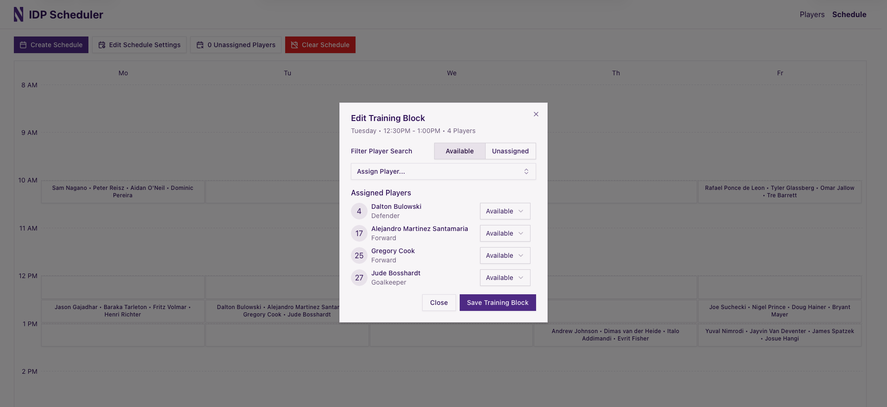

# NU Soccer IDP Scheduler

A frontend application the Northwestern Men's Soccer coaching staff for creating weekly training schedules based on player and field availability

## Demos

## Built With

### Technologies

### Libraries

## Usage

You may use this [players.json](readme/players.json) file as a starting point

## Contributing

Any contributions you make are **greatly appreciated**.

If you have a suggestion that would make this better, please fork the repo and create a pull request. You can also simply open an issue with the tag "enhancement".
Don't forget to give the project a star! Thanks again!

1. Fork the Project
2. Create your Feature Branch (`git checkout -b feature/AmazingFeature`)
3. Commit your Changes (`git commit -m 'Add some AmazingFeature'`)
4. Push to the Branch (`git push origin feature/AmazingFeature`)
5. Open a Pull Request

## License

This project is licensed under the MIT License - see the [LICENSE.md](https://github.com/LarryLing/idp-scheduler/blob/main/LICENSE.md) file for details

## Acknowledgments

* [TailwindCSS Docs](https://tailwindcss.com/docs/installation/using-vite)
* [ShadCN Docs](https://ui.shadcn.com/docs/installation)
* [Tanstack Table Docs](https://tanstack.com/table/latest/docs/introduction)
* [Tanstack Router Docs](https://tanstack.com/router/latest/docs/framework/react/overview)
* [React Hook Form Docs](https://react-hook-form.com)
* [Zod Docs](https://zod.dev)
* [Zustand Docs](https://zustand.docs.pmnd.rs/getting-started/introduction)
* [Lucide React Icons](https://lucide.dev)
* [TweakCN](https://tweakcn.com)
